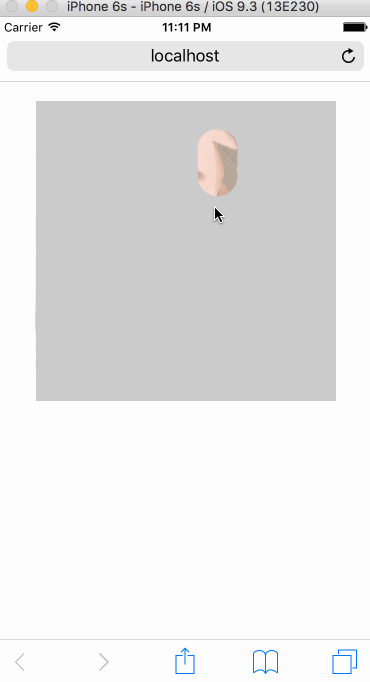

### ReactEraser

刮刮卡游戏(React版)

----

#### Usage

    import React,{ Component } from "react";
    import ReactDOM from "react-dom";
    import CanvasEraser from "./CanvasEraser";
    
    const config = {
            tip: "哟!刮出个大美女!",
            radius: 20,
            percent: 70,
            width: 300,
            height: 300,
            img: "img/beauty.jpg",
            notifyCallback: () => {
                alert(config.tip);
            }
        };
    
    class App extend Component {
        
        constructor(props) {
            super(props);
        }
        
        render() {
            return (
                

                    <CanvasEraser config={config} />
                

            );
        }
    
    }

#### 参数说明

属性名 | 意义 | 类型 | 默认值
---|---|---|---|---
percent | 透明区域大于percent%时,触发notifyCallback | Number | 70
tip | 提示文字 | String | 否 | 空字符串
notifyCallback | 达到触发条件后的回调函数 | Function| alert(this.cfg.tip)
width | 刮卡区域宽度 | Number | 300
height | 刮卡区域高度 | Number | 300
img | 刮卡否图 | String | 空
radius | 手指移动画圆半径 | Number | 20

安利下,事件模块来自本人另一项目[Toucher](https://github.com/rwson/Toucher),😄
